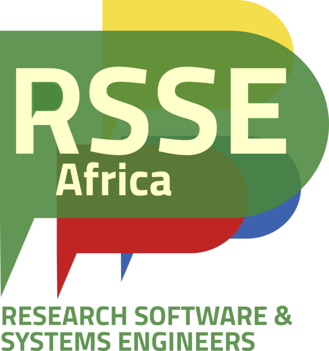

# RSSE AFRICA COMMUNITY

This is repository for the website of **RSSE AFRICA**.

> A forum for research software and infrastructure (compute/data) developers on the African continent that aims to share skills and opportunities and improve equity, diversity and inclusion within the global research software and systems engineering (RSSE) space.

## Want to join us?

We offer a wide variety of ways to get involved. From regular meetups to Slack and Discord. Choose the platform that works best for you. We look forward to seeing you in the community!

[sign up here ](https://talarify.us14.list-manage.com/subscribe?u=35d5db26d3b108b9ef9b9ac43&id=55e9f5a692) 

## Get Involved 

Read more [Here](/docs/CONTRIBUTING.md)

For More Informations check-out our [Website](https://rsse.africa/join/)