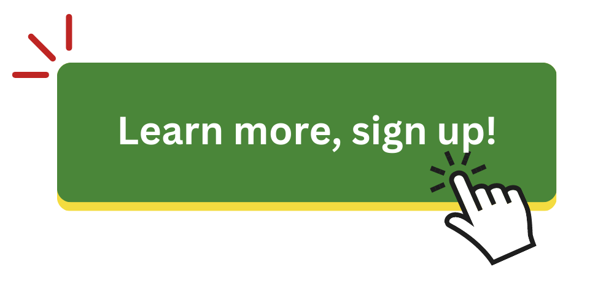

---
# Leave the homepage title empty to use the site title
title:
date: 2022-10-24
type: landing

sections:
  - block: hero
    id: about
    content:
      title: "Research Software & Systems Engineers of Africa"
      image:
        filename: rsse_africa_full_logo.png
      text: |
         
        A forum for research software  and infrastructure (compute/data) developers  on the African continent that aims to share skills and opportunities and improve equity, diversity and inclusion within the global research software and systems engineering (RSSE) space.
         
         

      cta:
        label: Sign up for our newsletter!
        url: https://talarify.us14.list-manage.com/subscribe?u=35d5db26d3b108b9ef9b9ac43&id=55e9f5a692

  - block: features
    content:
      title: Want to join us?
      subtitle: We offer a wide variety of ways to get involved. From regular meetups to Slack and Discord. Choose the platform that works best for you. We look forward to seeing you in the community! 
      text: |
        <a href="join"></img></a>

  - block: features
    id: what
    content:
      title: "What is research software?" 
      subtitle: |
          A number of definitions has been used to communicate about research software. To know who this community is for, we need to set the scope for what research software entails.  
      image:
        filename: 
      text: |
          For this community we will use the definition developed by the FAIR for Research Software working group (FAIR4RS) in 2021.

        # :thought_balloon:
        
        > Research Software includes source code files, algorithms, scripts, computational workflows
        > and executables that were created during the research process or for a research purpose.
        > Software components (e.g., operating systems, libraries, dependencies, packages, scripts,
        > etc.) that are used for research but were not created during or with a clear research intent
        > should be considered software in research and not Research Software. This differentiation
        > may vary between disciplines. The minimal requirement for achieving computational
        > reproducibility is that all the computational components (Research Software, software used
        > in research, documentation and hardware) used during the research are identified,
        > described, and made accessible to the extent that is possible.

        _Read the full report at https://doi.org/10.5281/zenodo.5504015._

      cta:
        label: Read the ReSA report
        url: https://talarify.us14.list-manage.com/subscribe?u=35d5db26d3b108b9ef9b9ac43&id=55e9f5a692

      cta_alt:
        label: Read the blog post by Vanessa Sochat
        url: https://vsoch.github.io/2020/what-is-research-software/

  - block: collection
    id: events
    content:
      title: Past & Upcoming Events
      count: 3
      filters:
        folders:
          - event
      sort_by: 'Date'
      sort_ascending: true
    design:
      columns: '2'
      view: compact

  - block: portfolio
    id: projects
    content:
      title: Community Projects
      subtitle: 
      text: 
      filters:
        # Folders to display content from
        folders:
          - project
        # Only show content with these tags
        tags: []
        # Exclude content with these tags
        exclude_tags: []
        # Which Hugo page kinds to show (https://gohugo.io/templates/section-templates/#page-kinds)
        kinds:
          - page
      # Field to sort by, such as Date or Title
      sort_by: 'Date'
      sort_ascending: false
      # Default portfolio filter button
      # 0 corresponds to the first button below and so on
      # For example, 0 will default to showing all content as the first button below shows content with *any* tag
      default_button_index: 0
      # Filter button toolbar (optional).
      # Add or remove as many buttons as you like.
      # To show all content, set `tag` to "*".
      # To filter by a specific tag, set `tag` to an existing tag name.
      # To remove the button toolbar, delete the entire `buttons` block.
      buttons:
        - name: All
          tag: '*'

    design:
      # See Page Builder docs for all section customization options.
      # Choose how many columns the section has. Valid values: '1' or '2'.
      columns: '1'
      # Choose a listing view
      view: showcase
      # For Showcase view, flip alternate rows?
      flip_alt_rows: false

  - block: collection
    id: posts
    content:
      title: Blog Posts
      subtitle: ''
      text: ''
      # Choose how many pages you would like to display (0 = all pages)
      count: 5
      # Filter on criteria
      filters:
        folders:
          - post
        author: ""
        category: ""
        tag: ""
        exclude_featured: false
        exclude_future: false
        exclude_past: false
        publication_type: ""
      # Choose how many pages you would like to offset by
      offset: 0
      # Page order: descending (desc) or ascending (asc) date.
      order: desc
    design:
      # Choose a layout view
      view: compact
      columns: '2'

  - block: twitter-block
    id: twitter-block
    content:
      title: Latest Tweets

---

